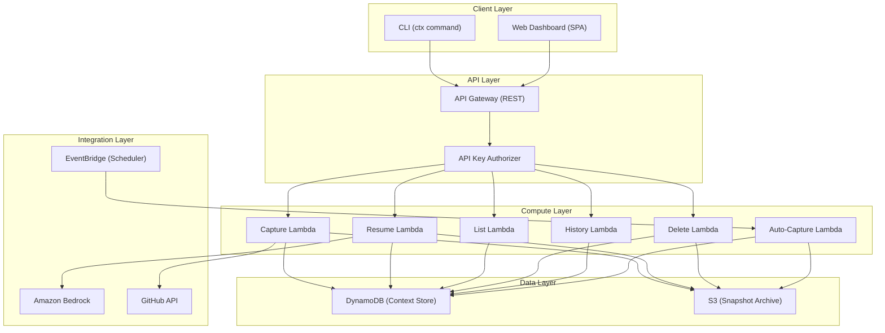

# Design Document: Context Switcher

## Overview

Context Switcher is a developer productivity tool that captures working state when switching between projects and generates AI-powered resumption briefings to minimize re-orientation time. The system consists of three interfaces — a CLI (`ctx`), a REST API, and a web dashboard — all backed by AWS serverless infrastructure.

The architecture follows a thin-client model: the CLI and web dashboard are lightweight frontends that delegate all business logic to Lambda functions accessed through API Gateway. DynamoDB serves as the primary data store, S3 handles overflow payloads, Amazon Bedrock generates briefings, and EventBridge drives scheduled auto-captures.

### Key Design Decisions

1. **Serverless-first**: All compute runs on Lambda, enabling zero infrastructure management and pay-per-use economics appropriate for a developer tool with bursty usage patterns.
2. **Project identifier derivation**: Projects are identified by a hash of the git remote origin URL (or local directory path as fallback). This provides stable, unique identification across machines.
3. **Overflow pattern for large snapshots**: DynamoDB's 400KB item limit is handled by storing large payloads in S3 with a reference pointer in DynamoDB, keeping the fast-path simple while supporting large diffs.
4. **Graceful degradation**: GitHub integration and Bedrock briefing generation are non-blocking — failures fall back to raw data display rather than breaking the core capture/resume workflow.
5. **Single-table DynamoDB design**: All entities (snapshots, projects, user metadata) share one table using composite keys, reducing operational overhead and enabling efficient access patterns.

## Architecture



### Request Flow

1. CLI/Web sends request to API Gateway with API key in header
2. API Gateway validates the API key against a registered keys table
3. Request routes to the appropriate Lambda function
4. Lambda executes business logic, interacting with DynamoDB/S3/Bedrock/GitHub as needed
5. Response returns through API Gateway to the client

## Components and Interfaces

### CLI Component

The CLI is a standalone binary (Node.js/TypeScript compiled with `pkg` or distributed via npm) that provides the `ctx` command with subcommands.

**Subcommands:**
- `ctx park [--note "text"] [--history]` — Capture current context
- `ctx resume [project-name]` — Generate and display resumption briefing
- `ctx list` — List all projects
- `ctx delete <project-name>` — Delete a project's snapshots
- `ctx history <project-name>` — Show snapshot history for a project

**Local responsibilities:**
- Detect git repository and extract git state (branch, commits, diff, modified files)
- Read terminal history when `--history` flag is provided
- Derive project identifier from git remote or directory path
- Format and display output (briefings, lists, errors)
- Read API key from local config file (`~/.ctx/config.json`)

### API Gateway

**Base URL:** `https://{api-id}.execute-api.{region}.amazonaws.com/v1`

**Endpoints:**

| Method | Path | Lambda | Description |
|--------|------|--------|-------------|
| POST | /snapshots | Capture Lambda | Park a project |
| GET | /snapshots/{project}/latest | Resume Lambda | Get briefing |
| GET | /projects | List Lambda | List projects |
| DELETE | /projects/{project} | Delete Lambda | Delete project |
| GET | /snapshots/{project}/history | History Lambda | Snapshot history |

**Authentication:** API key passed in `x-api-key` header. API Gateway validates against usage plan.

### Capture Lambda

**Input:** Snapshot payload from CLI containing git state, modified files, optional notes, optional terminal history, optional GitHub data.

**Responsibilities:**
- Validate payload structure and enforce size limits (note ≤ 5000 chars, history ≤ 50 lines)
- If payload > 400KB, store in S3 and save reference in DynamoDB
- If GitHub integration configured, fetch PR and review data (10s timeout per request)
- Store snapshot with timestamp, project ID, developer ID, and source field ("manual" or "auto")

### Resume Lambda

**Input:** Project name (path parameter).

**Responsibilities:**
- Retrieve most recent snapshot for the project (fetch from S3 if overflow reference exists)
- Invoke Bedrock to generate briefing with 15-second timeout
- On Bedrock failure or timeout, return raw snapshot data with fallback indicator
- Return formatted briefing response

### List/History/Delete Lambdas

Thin CRUD operations over DynamoDB, scoped to the authenticated developer's data.

### Auto-Capture Lambda

**Trigger:** EventBridge scheduled rule (developer-configured cron expression).

**Responsibilities:**
- Iterate over configured projects (max 20)
- For each project, perform capture using stored configuration
- Mark snapshot source as "auto"
- Log successes and failures, continue on individual project failure
- Record summary of capture run

### Web Dashboard

A static SPA (React/TypeScript) hosted on S3 + CloudFront. Authenticates via session cookies backed by a Cognito user pool or simple token exchange. Calls the same API Gateway endpoints as the CLI.

### Briefing Generator (Bedrock Integration)

**Model:** Amazon Bedrock (Claude or equivalent model via Bedrock API).

**Prompt structure:** System prompt defines the briefing format (4 sections, 500-word max, project-specific terminology only). User message provides the snapshot data.

**Output format:**
```
## Last Session Summary
[paragraph]

## Key Changes
[bullet list]

## Open Items
[bullet list, includes verbatim developer notes]

## Suggested Next Steps
[numbered list]
```

## Data Models

### DynamoDB Table: `ctx-switch-context-store`

**Single-table design with composite keys:**

| PK | SK | Attributes |
|----|----|------------|
| `USER#{userId}` | `PROJECT#{projectId}` | projectName, lastParkTimestamp, summary, snapshotCount |
| `USER#{userId}` | `SNAPSHOT#{projectId}#{timestamp}` | gitBranch, commits[], modifiedFiles[], note, terminalHistory, githubPrs[], reviewComments[], source, payloadRef (optional S3 key), ttl |

**Access Patterns:**

1. **List projects for user:** PK = `USER#{userId}`, SK begins_with `PROJECT#`
2. **Get latest snapshot:** PK = `USER#{userId}`, SK begins_with `SNAPSHOT#{projectId}#`, ScanIndexForward=false, Limit=1
3. **Get snapshot history:** PK = `USER#{userId}`, SK begins_with `SNAPSHOT#{projectId}#`, ScanIndexForward=false, Limit=10
4. **Delete project snapshots:** PK = `USER#{userId}`, SK begins_with `SNAPSHOT#{projectId}#` (batch delete) + delete project record

**GSI-1 (Auto-capture lookup):**

| PK | SK |
|----|----|
| `AUTOCAP#{userId}` | `PROJECT#{projectId}` |

Used by the auto-capture Lambda to find which projects are configured for scheduled captures.

### S3 Bucket: `ctx-switch-snapshot-archive`

**Key format:** `{userId}/{projectId}/{timestamp}.json`

Stores full snapshot payload when it exceeds the 400KB DynamoDB threshold. Objects have a lifecycle policy for automatic cleanup (configurable TTL, default 90 days).

### Configuration File (`~/.ctx/config.json`)

```json
{
  "apiKey": "ctx-xxxxxxxxxxxxxxxx",
  "apiEndpoint": "https://{api-id}.execute-api.{region}.amazonaws.com/v1",
  "githubToken": "ghp_xxxxxxxxxxxx",
  "defaultNote": "",
  "autoCapture": {
    "enabled": false,
    "schedule": "0 17 * * MON-FRI",
    "projects": []
  }
}
```

### Snapshot Payload Schema

```typescript
interface Snapshot {
  projectId: string;
  projectName: string;
  timestamp: string; // ISO 8601
  source: "manual" | "auto";
  git: {
    branch: string;
    lastCommits: string[]; // max 5
    uncommittedDiff: string;
    modifiedFiles: string[];
  };
  note?: string; // max 5000 chars
  terminalHistory?: string[]; // max 50 lines
  github?: {
    pullRequests: PullRequest[]; // max 20
    unresolvedComments: ReviewComment[]; // max 50
  };
}

interface PullRequest {
  number: number;
  title: string;
  url: string;
  state: string;
}

interface ReviewComment {
  prNumber: number;
  body: string;
  path: string;
  line: number;
  status: "open" | "resolved" | "dismissed";
}
```

## Correctness Properties

*A property is a characteristic or behavior that should hold true across all valid executions of a system — essentially, a formal statement about what the system should do. Properties serve as the bridge between human-readable specifications and machine-verifiable correctness guarantees.*

### Property 1: Snapshot captures complete git state

*For any* git repository with a branch name, commit history, uncommitted changes, and modified files, the capture function SHALL produce a snapshot containing the exact branch name, the last 5 (or fewer if less exist) commit messages, the full uncommitted diff, and the complete list of modified files.

**Validates: Requirements 1.1, 1.2**

### Property 2: Input field limits are enforced

*For any* note string and terminal history array, the capture function SHALL store the note verbatim if its length is ≤ 5000 characters and reject it otherwise, and SHALL store at most the last 50 lines of terminal history.

**Validates: Requirements 1.3, 1.4**

### Property 3: Project identifier derivation is deterministic

*For any* git remote origin URL or local directory path, the project identifier derivation function SHALL produce the same output when called multiple times with the same input, and SHALL produce a non-empty string.

**Validates: Requirements 1.5**

### Property 4: Overflow routing by payload size

*For any* snapshot payload, if the serialized size exceeds 400KB then the system SHALL route it to S3 and store a reference in DynamoDB; if the size is ≤ 400KB the system SHALL store it directly in DynamoDB.

**Validates: Requirements 1.7**

### Property 5: Output messages contain project identifiers

*For any* project name, confirmation messages after successful park SHALL contain that project name and a timestamp, and error messages for missing projects SHALL contain the queried project name in the format "No context has been captured for project '<project-name>'".

**Validates: Requirements 1.6, 2.4**

### Property 6: Listings are ordered newest-first

*For any* set of projects or snapshots with distinct timestamps, the list and history commands SHALL return items ordered by timestamp descending (newest first).

**Validates: Requirements 2.5, 3.3**

### Property 7: Summary truncation to 80 characters

*For any* snapshot summary string, the list and history display functions SHALL truncate the displayed summary to at most 80 characters while preserving the project name and timestamp.

**Validates: Requirements 3.1, 3.3**

### Property 8: GitHub data respects configured maximums

*For any* GitHub API response containing N pull requests and M review comments, the capture function SHALL include at most 20 pull requests and at most 50 unresolved review comments in the snapshot.

**Validates: Requirements 4.1, 4.2**

### Property 9: Tenant data isolation

*For any* two distinct authenticated users A and B, user A SHALL never receive snapshot data, project listings, or briefings belonging to user B. Cross-user access SHALL return the same response as a non-existent project.

**Validates: Requirements 5.3, 5.4, 5.5**

### Property 10: Auto-capture configuration enforcement

*For any* auto-capture configuration with N configured projects, the auto-capture function SHALL process at most 20 projects, and every snapshot produced SHALL have its source field set to "auto".

**Validates: Requirements 7.1, 7.3**

### Property 11: Auto-capture resilience

*For any* set of configured projects where a subset fail during capture, the auto-capture function SHALL successfully capture all non-failing projects and produce a summary where the success count plus failure count equals the total projects attempted.

**Validates: Requirements 7.4, 7.5**

### Property 12: Briefing structure and content constraints

*For any* valid snapshot, the generated briefing SHALL contain exactly four sections in this order: "Last Session Summary", "Key Changes", "Open Items", "Suggested Next Steps". The total briefing length SHALL be ≤ 500 words. Any developer-provided notes SHALL appear verbatim in the "Open Items" section. Any section with no relevant snapshot data SHALL display "None" under its heading.

**Validates: Requirements 8.1, 8.2, 8.3, 8.5**

## Error Handling

### Error Categories

| Category | Trigger | User-Facing Behavior |
|----------|---------|---------------------|
| **Git state errors** | Not a git repo, corrupt git state | CLI displays clear error, operation aborts |
| **Network/storage errors** | DynamoDB/S3 unreachable, timeout | CLI displays storage failure message, snapshot not saved |
| **Auth errors** | Missing/invalid/revoked API key | API returns 401, CLI prompts to check configuration |
| **GitHub integration errors** | Auth failure, rate limit, timeout | Logged and skipped; capture continues without GitHub data |
| **Bedrock errors** | Model unavailable, timeout (>15s) | Falls back to raw snapshot display with warning |
| **Validation errors** | Note too long, invalid input | CLI displays specific validation error, operation aborts |
| **Not found errors** | Project doesn't exist | CLI displays "project not found" message |

### Error Handling Principles

1. **Fail fast for critical errors**: Git detection and auth failures abort immediately with clear messages.
2. **Graceful degradation for optional integrations**: GitHub and Bedrock failures never block core capture/resume functionality.
3. **No silent failures**: Every error produces user-visible output explaining what happened and what to do.
4. **Idempotent retries**: CLI operations are safe to retry — parking the same state twice creates a new snapshot rather than corrupting existing data.

### Retry Strategy

- **DynamoDB**: AWS SDK automatic retries with exponential backoff (3 attempts).
- **S3**: Same as DynamoDB.
- **Bedrock**: No retry — fall back to raw data immediately on failure.
- **GitHub API**: No retry per request — 10s timeout then skip.
- **Auto-capture**: No retry per project — log failure and continue to next project.

## Testing Strategy

### Unit Tests

Focus on pure business logic functions:
- Project ID derivation from various git remote formats and directory paths
- Payload size calculation and overflow routing decision
- Summary truncation logic
- Timestamp sorting
- Briefing response parsing and section extraction
- Note and history field validation
- GitHub data limit enforcement
- Auto-capture summary calculation
- CLI output formatting

### Property-Based Tests

Property-based testing is applicable to this feature because it contains significant pure logic (data transformation, validation, formatting) with wide input spaces.

**Library:** [fast-check](https://github.com/dubzzz/fast-check) (TypeScript/JavaScript)

**Configuration:**
- Minimum 100 iterations per property test
- Each test tagged with: `Feature: context-switcher, Property {N}: {title}`

**Properties to implement:**
1. Snapshot completeness (Property 1)
2. Input field limits (Property 2)
3. Project ID determinism (Property 3)
4. Overflow routing (Property 4)
5. Output message content (Property 5)
6. Listing order (Property 6)
7. Summary truncation (Property 7)
8. GitHub data limits (Property 8)
9. Tenant isolation (Property 9)
10. Auto-capture configuration (Property 10)
11. Auto-capture resilience (Property 11)
12. Briefing structure (Property 12)

### Integration Tests

- API Gateway authentication enforcement (valid key, invalid key, missing key, revoked key)
- End-to-end park → resume flow with real DynamoDB and S3 (localstack)
- Bedrock timeout and fallback behavior
- GitHub API error handling (mocked responses)
- EventBridge trigger fires auto-capture Lambda
- Web dashboard authentication flow and session timeout

### End-to-End Tests

- Full CLI workflow: park → list → history → resume → delete
- Multi-user isolation: two users cannot see each other's data
- Large payload overflow to S3 and successful retrieval on resume
- Auto-capture scheduled run with mixed success/failure

